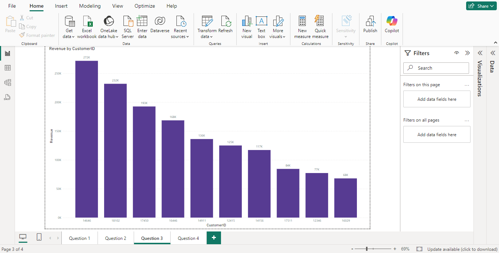

# Online Retail Store Revenue Analysis

## Problem Statement

The **CEO** and **CMO** of an online retail store are interested in gaining insights into various aspects of the business to enhance revenue generation, improve customer retention, and identify expansion opportunities. This was developed to answer key business questions focused on monthly revenue trends, top revenue-generating countries, customer insights, and demand analysis by region.

## Questions Addressed

### For the CEO:
1. **Monthly Revenue Trend for 2011**:
   - The CEO wants to analyze the monthly revenue trend for 2011, identifying seasonal trends and understanding revenue fluctuations.
   
2. **Regional Demand Insights**:
   - The CEO seeks to identify regions with the greatest demand for their products (excluding the UK) to plan expansion strategies and maximize revenue.

### For the CMO:
1. **Top 10 Countries by Revenue**:
   - The CMO wants to view the top 10 countries generating the highest revenue, along with the quantity of products sold, excluding the United Kingdom.

2. **Top 10 Customers by Revenue**:
   - The CMO is interested in identifying the top 10 customers by revenue to target high-value customers with marketing strategies aimed at improving customer retention and satisfaction.

---

## Recommendations

### 1. **Revenue Trends and Forecasting**:
    
  
   - Based on the monthly revenue trends in 2011, there are clear seasonal fluctuations that can be leveraged for marketing campaigns and product launches during peak periods.

### 2. **Regional Demand Expansion**:

   - Regions showing the highest demand (excluding the UK) present significant expansion opportunities. These areas should be prioritized for marketing efforts and product availability.

### 3. **Top Countries by Revenue**:

   - The analysis of the top 10 countries reveals significant revenue concentration in key markets. Understanding why these countries perform well can help replicate success in other regions.

### 4. **Top Customers by Revenue**:

   - Targeted engagement with the top 10 customers is critical, as they generate a large portion of the store's revenue. Personalized marketing can ensure repeat purchases and customer loyalty.

---
## Overall Dashboard and Insights

### **Overall Dashboard:**
The overall dashboard provides a holistic view of the retail store’s performance in 2011, highlighting key metrics like revenue, quantity sold, and customer distribution across various regions. The dashboard also features visualizations that allow the user to drill down into more granular data and understand trends and patterns at both the macro and micro levels.

### **Key Insights**:
1. **Seasonality in Revenue**: 
   - There are clear seasonal trends in the monthly revenue for 2011, with peaks observed in specific months such as November and December. This aligns with typical holiday seasons and high shopping periods.
   - **Recommendation**:Use the data to forecast future revenue and allocate resources effectively to capitalize on high-revenue months. The store should increase inventory and focus on marketing during peak months to maximize sales.

2. **High Demand Regions**:
   - Certain regions (excluding the UK) such as Germany, France, and the Netherlands have consistently high demand for products. This presents an opportunity for the retail store to expand its market presence in these countries.
   - **Recommendation**:Focus on expanding the product line in high-demand regions and enhance distribution to capture untapped market potential. Tailor marketing strategies to these high-demand regions and explore opportunities to open physical stores or increase online presence there.

3. **Concentration of Revenue from Top Countries**:
   - The top 10 countries by revenue contribute significantly to the overall sales, indicating a high concentration of revenue in a few markets. This insight can help the store focus efforts on nurturing these markets.
   - **Recommendation**: Maintain strong relationships with top-performing countries while exploring adjacent markets that may have similar demographics or demand.

4. **Top Customers Drive Revenue**:
   - A small number of customers contribute a large share of the revenue, making customer retention strategies vital for the business.
   - **Recommendation**: Offer loyalty programs, personalized offers, and exclusive discounts to top customers to increase customer lifetime value (CLV) and ensure long-term revenue growth.

---

## Conclusion

This Dashboard provides actionable insights that will help the retail store’s leadership team make informed decisions. From analyzing seasonal trends and expanding into high-demand regions to focusing on customer retention, the dashboard supports both short-term and long-term strategic planning. By implementing the recommendations, the retail store can improve its revenue streams, optimize marketing strategies, and capture untapped market potential.
